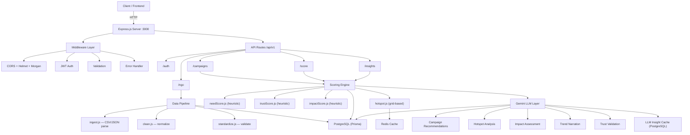

# Backend Walkthrough — CIPSS Social Impact Platform

## Architecture Overview



---

## File Structure (24 files)

```
backend/
├── package.json                    # Deps & scripts
├── .env.example                    # Env var template
├── .gitignore
├── prisma/
│   └── schema.prisma               # 5 models: NGO, NGOMetric, Campaign, User, LLMInsight
├── scripts/
│   └── seed.js                     # Dev data (5 NGOs, 60+ metrics, 10 campaigns, 4 users)
└── src/
    ├── index.js                    # Express app entry point
    ├── lib/
    │   ├── prisma.js               # Singleton Prisma client
    │   ├── redis.js                # Redis client + helpers (graceful fallback)
    │   └── gemini.js               # Vertex AI Gemini client (lazy init, graceful fallback)
    ├── middleware/
    │   ├── auth.js                 # JWT verify + role-based access control
    │   ├── validate.js             # express-validator error collector
    │   └── errorHandler.js         # Global error handler (Prisma/JWT/Multer aware)
    ├── services/
    │   ├── needScore.js            # Heuristic: frequency × severity × recency × pastAction
    │   ├── trustScore.js           # Heuristic: engagement × authenticity × consistency × pastImpact
    │   ├── impactScore.js          # Heuristic: completionRate × volunteerFactor × proofMultiplier
    │   ├── hotspot.js              # Grid-based hotspot detection with Redis cache
    │   └── llmInsights.js          # 5 Gemini-powered functions with DB-level LLM cache
    ├── pipelines/
    │   ├── clean.js                # Domain normalization, unit conversion, coord validation
    │   ├── standardize.js          # Row standardizer (handles messy column names)
    │   └── ingest.js               # CSV/JSON ingestion → clean → dedup → bulk insert
    └── api/
        ├── auth.js                 # POST /register, POST /login
        ├── ngo.js                  # POST /, GET /:id, POST /upload, GET /:id/metrics
        ├── campaigns.js            # POST /, GET /, GET /recommended, GET /:id, PATCH /:id/complete
        ├── scores.js               # GET /need, GET /trust, GET /impact
        └── insights.js             # GET /hotspots, GET /trends, GET /need-score
```

---

## Gemini LLM Integration — How It Works

The LLM layer sits **on top of** the heuristic scoring, never replacing it. Every feature degrades gracefully:

| Feature | Endpoint | Trigger | What Gemini Does |
|---------|----------|---------|-----------------|
| Campaign Recommendation | `POST /campaigns` | Auto (fire-and-forget) | Strategic assessment + priority + risks |
| Hotspot Analysis | `GET /insights/hotspots?llm_analysis=true` | Opt-in query param | Pattern analysis, coverage gaps, suggested actions |
| Impact Assessment | `PATCH /campaigns/:id/complete` | Auto (fire-and-forget) | Evaluates real-world significance of impact score |
| Trend Narration | `GET /insights/trends?llm_narrate=true` | Opt-in query param | Natural-language summary of time-series data |
| Trust Validation | `GET /score/trust?llm_validate=true` | Opt-in query param | Cross-checks heuristic score, flags anomalies |

> [!TIP]
> LLM features are **opt-in** via query params (`?llm_analysis=true`) or fire-and-forget background tasks. The API always returns heuristic scores immediately — LLM enrichment is additive.

> [!NOTE]
> LLM responses are cached in the `llm_insights` PostgreSQL table with a 6-hour TTL to avoid redundant Gemini API calls.

---

## API Quick Reference

### Base URL: `http://localhost:3000/api/v1`

### Auth
| Method | Route | Auth | Description |
|--------|-------|------|-------------|
| POST | `/auth/register` | ❌ | Create account |
| POST | `/auth/login` | ❌ | Get JWT |

### NGO
| Method | Route | Auth | Description |
|--------|-------|------|-------------|
| POST | `/ngo` | ✅ | Create NGO |
| GET | `/ngo/:id` | ❌ | Get NGO details |
| POST | `/ngo/upload` | ✅ | Upload metrics (CSV/JSON) |
| GET | `/ngo/:id/metrics` | ❌ | List NGO metrics |

### Campaigns
| Method | Route | Auth | Description |
|--------|-------|------|-------------|
| POST | `/campaigns` | ✅ | Create (auto-scores need + trust, async LLM rec) |
| GET | `/campaigns` | ❌ | List (filter: domain, status, ngo_id) |
| GET | `/campaigns/recommended` | ❌ | Top by need score |
| GET | `/campaigns/:id` | ❌ | Single campaign + LLM rec |
| PATCH | `/campaigns/:id/complete` | ✅ | Mark done, compute impact, async LLM assessment |

### Scores
| Method | Route | Auth | Description |
|--------|-------|------|-------------|
| GET | `/score/need` | ❌ | `?area=&domain=` |
| GET | `/score/trust` | ❌ | `?ngo_id=&llm_validate=true` |
| GET | `/score/impact` | ❌ | `?campaign_id=` |

### Insights
| Method | Route | Auth | Description |
|--------|-------|------|-------------|
| GET | `/insights/hotspots` | ❌ | `?domain=&lat=&lng=&radius=&llm_analysis=true` |
| GET | `/insights/trends` | ❌ | `?domain=&area=&period=&llm_narrate=true` |
| GET | `/insights/need-score` | ❌ | `?lat=&lng=&domain=&radius=` |

---

## Getting Started

```bash
cd backend

# 1. Install dependencies
npm install

# 2. Copy env template and fill in your values
cp .env.example .env

# 3. Generate Prisma client
npx prisma generate

# 4. Run migrations (requires PostgreSQL)
npx prisma migrate dev --name init

# 5. Seed sample data
npm run seed

# 6. Start dev server
npm run dev
```

> [!IMPORTANT]
> **Prerequisites**: Node.js 20+, PostgreSQL running locally.
> **Optional**: Redis (app works without it), GCP credentials for Gemini (heuristic scoring works without it).
